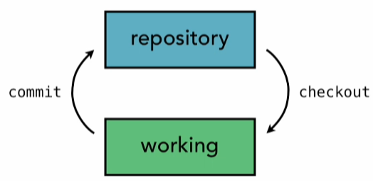
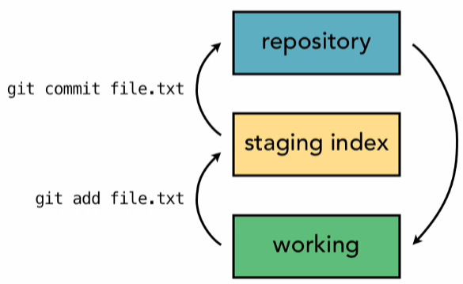

# Distributed Version Control System
> My entire documentation for creating a ```git clone``` not just the command :)

> ```git``` at its core, is a system of interconnected text files that reference each other through filenames.

## The Basics - Understanding Git: 
Consider Git as a tool that manages a filesystem by capturing snapshots of its state at different points in time.

 It is a content-addressable filesystem, acting as a key-value store(or more like value-value store, as it computes keys from data itself). Insert content into a Git repository, and Git returns a unique key to retrieve it later.

Common locations where code stays in git:
1. Local Working Directory (Code Playground)
2. Staging Area (Temporary holding spot for files before commiting)
3. Local Repository (Place where we store commited changes locally)
4. Remote Repository (Server for sharing and backing up code)


>Git uses Three-tree Architecture. 

So whats that?

### 1. Two-tree Architecture.

This is what a lot of other VCS use such as Subversion. They have a working tree and repository



### 2. Three-tree Architecture
Git has the working tree and the repository, and additionally in between is another tree which is the staging area.



### Git File States

In Git, files can be in one of three states:

1. **Modified / Untracked**  
   - *Modified*: You've changed the file but haven't saved those changes to your Git history yet.
   - *Untracked*: These files are new and aren't being tracked by Git. They weren't part of the last commit and haven't been added to staging.

2. **Staged**  
   - You've marked the modified file to be included in the next commit. It's ready to be saved to the Git history.

3. **Committed**  
   - The file's changes are safely stored in the Git repository.


## Part 1: .git Directory - git init

What does .git directory even contain?

This:

```
$ tree .git

.git
├── config
├── HEAD
├── hooks
│   └── prepare-commit-msg.msample
├── index
├── objects
│   ├── info
│   └── pack
└── refs
    ├── heads
    └── tags

```
> Note: if you want tree structure like above for your folder : ``` brew install tree```

### Git Folder and File Structure

When you initialize a Git repository, several files and folders are created. Here's a breakdown of what they are and what they do:

1. **config**  
   - This text file contains the configuration settings for your repository, such as the author information, file modes, and other basic settings.

2. **HEAD**  
   - The `HEAD` file tracks the current branch of the repository. It usually points to `refs/heads/main`, `refs/heads/master`, or another default branch, depending on your setup. After your first commit, the branch file (e.g., `master`) will appear under `refs/heads`.

3. **index**  
   - The staging area! This binary file tracks files that are staged for the next commit. It stores file paths, hashes, modes, and metadata.

4. **hooks**  
   - This folder contains scripts that Git can run automatically before or after certain actions (like committing or pushing).

5. **objects**  
   - This folder stores the actual Git objects, which represent your repository's data, such as files, commits, and changes.

6. **refs**  
   - `refs` holds references or pointers to branches and tags.  
   - `refs/heads` contains pointers to branches.  
   - `refs/tags` contains pointers to tags.

Each of these plays a critical role in how Git manages your repository!

> So how do you even initialize a git repo
```git
git init
```

Now for the implementation:
#### Initializing a Git Repository:
A Step-by-Step Breakdown This code snippet demonstrates the process of initializing a new Git repository. Let's break it down into simple steps: 

**1. Creating the Root Directory:** The code starts by creating a new directory named ".git" in the current location. This directory will serve as the root of our Git repository. 
```java
final File root = new File(".git");
```

**2. Setting Up Essential Subdirectories:** Inside the ".git" folder, crucial subdirectories are created:
- objects: This directory will store all the Git objects.
- refs/heads: This directory will contain references to branches.
- refs/tags: This directory will contain references to tags.
```java
new File(root, "objects").mkdirs(); 
new File(root, "refs/heads").mkdirs();
new File(root, "refs/tags").mkdirs();
```

**3. Creating the HEAD File:** A new file named "HEAD" is created in the ".git" directory. This file is essential for Git as it points to the current branch.
```java
final File head = new File(root, "HEAD");
```

**4. Writing to the HEAD File:** The code writes the following content to the HEAD file:
```text
ref: refs/heads/main
```

This line tells Git that the current branch is "main".
```java
head.createNewFile(); 
Files.write(head.toPath(), "ref: refs/heads/main\n".getBytes());
```

**5. Creating Config File:** The config file is created with default settings:
```java
Config.createDefaultConfig();
```

**6. Confirmation Message:** If all steps are successful, the code prints a confirmation message:
```java
System.out.println("Initialized git directory");
```

This code essentially mimics the basic structure creation that occurs when you run `git init` in a directory. It sets up the fundamental components needed for Git to start tracking your project.

## Git Objects
So we will be dealing with 3 Git objects: 
**1. Blobs:** Used to store file data (only content of file without name or permissions) \
**2. Trees:** Store directory structures(including names and permissions) \
**3. Commits:** Keeps the data like commit message, author, commiter, parent commits, etc.. 

Every Git object is identified by a unique 40-character SHA-1 hash, called the "object hash."
for example: `9fb8b43296432c0f2212264f2206cff35b0c63`

The SHA-1 hash in Git is a 40-character identifier that ensures: \
**Uniqueness:** Each commit and content piece is uniquely tracked. \
**Integrity:** Detects data corruption or tampering. 

### Object Storage Structure

```
.git/objects/
├── 9f/
│   └── b8b43296432c0f2212264f2206cff35b0c63
├── a1/
│   └── b2c3d4e5f6a7b8c9d0e1f2a3b4c5d6e7f8a9b0
└── ...
```

Objects are stored compressed using zlib, with the first 2 characters of the hash as the directory name.

## Part 2: Reading Objects - git cat-file

Blobs are binary large objects. 

`git cat-file` prints an existing git object to the standard output.

you don't modify a file in git, you create a new file in a different location.

In git repository, the paths are actually determined by contents. 

How to read and decode a Git object (specifically a blob) from the Git object database. Let's break it down step by step: 

**1. Parsing the Object Hash:** The code starts by splitting the provided hash into two parts
```java
String hash = args[2];
String dirHash = hash.substring(0, 2); 
String fileHash = hash.substring(2);
```
- **dirHash**: The first two characters of the hash, used as the directory name.
- **fileHash**: The remaining characters, used as the file name.

**2. Locating the Object File:** The code constructs the path to the object file in the Git object database:
```java
File objectFile = new File(".git/objects/" + dirHash + "/" + fileHash);
```

This path follows Git's object storage structure: `.git/objects/xx/yyyyyyyyy`.

**3. Reading and Inflating the Object Content:** Git stores objects in a compressed format. The code reads and decompresses the object:
```java
ByteArrayOutputStream baos = new ByteArrayOutputStream();
try (InflaterInputStream iis = new InflaterInputStream(new FileInputStream(objectFile))) {
    byte[] buffer = new byte[8192];
    int len;
    while ((len = iis.read(buffer)) != -1) {
        baos.write(buffer, 0, len);
    }
}
```

**4. Parsing Object Type:** Git prepends metadata to the object content. The code extracts the type and content:
```java
byte[] data = baos.toByteArray();
int nullIndex = -1;
for (int i = 0; i < data.length; i++) {
    if (data[i] == 0) {
        nullIndex = i;
        break;
    }
}
String header = new String(data, 0, nullIndex);
String[] parts = header.split(" ");
String type = parts[0]; // "blob", "tree", or "commit"
byte[] content = Arrays.copyOfRange(data, nullIndex + 1, data.length);
```

**5. Formatting Output:** Based on object type:
- **Blob**: Print content directly
- **Tree**: Parse and format tree entries
- **Commit**: Print commit metadata and message

This code essentially replicates what happens when you use `git cat-file -p <hash>` command, supporting all object types.

## Part 3: Creating Blob Objects - git hash-object

`git hash-object` converts an existing file into a git object and stores it in the object database.

**Usage:**
```bash
git hash-object <file>
```

**Process:**
```
File Content → Blob Object → Compressed → Stored → Hash Returned
```

**Implementation Steps:**

1. **Read File Content:**
```java
byte[] content = Files.readAllBytes(file.toPath());
```

2. **Create Object Header:**
```java
String header = "blob " + content.length + "\0";
```

3. **Combine Header and Content:**
```java
byte[] fullData = new byte[header.length() + content.length];
System.arraycopy(header.getBytes(), 0, fullData, 0, header.length());
System.arraycopy(content, 0, fullData, header.length(), content.length);
```

4. **Calculate SHA-1 Hash:**
```java
String hash = sha1Hash(fullData);
```

5. **Compress and Store:**
```java
ByteArrayOutputStream baos = new ByteArrayOutputStream();
try (DeflaterOutputStream dos = new DeflaterOutputStream(baos)) {
    dos.write(fullData);
}
writeObject(hash, baos.toByteArray());
```

6. **Return Hash:**
```java
System.out.println(hash);
```

## Part 4: Tree Objects - git ls-tree & write-tree

### Understanding Tree Objects

Trees represent directory structures. Each tree entry contains:
- **Mode**: File permissions (e.g., "100644" for files, "40000" for directories)
- **Name**: File or directory name
- **Hash**: SHA-1 hash of the blob or tree object

```
Tree Object Structure:
┌─────────────────────────────────────┐
│ mode name\0hash(20 bytes)           │
│ 100644 file.txt\0a1b2c3...          │
│ 40000  dir\0d4e5f6...               │
└─────────────────────────────────────┘
```

### git ls-tree

Lists the contents of a tree object.

**Usage:**
```bash
git ls-tree <tree-hash>
git ls-tree <tree-hash> --name-only
```

**Output Format:**
```
100644 blob a1b2c3d4...    file.txt
40000  tree d4e5f6a7...    directory
```

**Implementation:**
1. Parse tree object
2. Read entries sequentially (mode, name, hash)
3. Format and display

### git write-tree

Creates a tree object from the current working directory (excluding .git).

**Process:**
```
Working Directory → Scan Files → Create Blobs → Build Tree Structure → Store Tree Object
```

**Implementation Steps:**

1. **Recursively Scan Directory:**
```java
private static String writeTreeRecursive(File dir, String prefix) {
    // Filter out .git directory
    // Sort entries alphabetically
    // Process files and subdirectories
}
```

2. **Create Blob for Files:**
```java
byte[] content = Files.readAllBytes(file.toPath());
String blobHash = ObjectStore.storeObject("blob", content);
```

3. **Recursively Process Directories:**
```java
if (file.isDirectory()) {
    String treeHash = writeTreeRecursive(file, path);
    entries.add(new TreeEntry("40000", name, treeHash));
}
```

4. **Build Tree Object:**
```java
ByteArrayOutputStream baos = new ByteArrayOutputStream();
for (TreeEntry entry : entries) {
    baos.write(entry.mode.getBytes());
    baos.write(' ');
    baos.write(entry.name.getBytes());
    baos.write(0);
    byte[] hashBytes = hexToBytes(entry.hash);
    baos.write(hashBytes);
}
return ObjectStore.storeObject("tree", baos.toByteArray());
```

## Part 5: The Index (Staging Area)

The index is Git's staging area - a binary file that tracks what will be included in the next commit.

### Index File Format

```
┌─────────────────────────────────────────┐
│ Header (12 bytes)                       │
│ - Signature: "DIRC" (4 bytes)           │
│ - Version: 2 (4 bytes)                  │
│ - Entry Count (4 bytes)                 │
├─────────────────────────────────────────┤
│ Entry 1 (62+ bytes)                     │
│ - ctime (8 bytes)                       │
│ - mtime (8 bytes)                       │
│ - dev, ino, mode, uid, gid (20 bytes)   │
│ - file size (4 bytes)                   │
│ - SHA-1 hash (20 bytes)                 │
│ - flags (2 bytes)                       │
│ - path name (variable, null-terminated) │
│ - padding to 8-byte boundary            │
├─────────────────────────────────────────┤
│ Entry 2...                              │
├─────────────────────────────────────────┤
│ SHA-1 Checksum (20 bytes)               │
└─────────────────────────────────────────┘
```

### git add

Stages files for the next commit by adding them to the index.

**Usage:**
```bash
git add <file>
git add <directory>  # Recursively adds all files
```

**Process:**
```
File → Create Blob → Add Entry to Index → Index Updated
```

**Implementation:**
1. Read file content
2. Create blob object (`hash-object`)
3. Add entry to index with mode and hash
4. Write updated index file

The index acts as the bridge between your working directory and commits!

## Part 6: Commits - git commit-tree & commit

### Commit Object Structure

```
commit <size>\0
tree <tree-hash>
parent <parent-hash>  (optional, can be multiple)
author <name> <email> <timestamp> <timezone>
committer <name> <email> <timestamp> <timezone>

<commit message>
```

### git commit-tree

Creates a commit object from a tree hash.

**Usage:**
```bash
git commit-tree <tree-hash> -m "message" -p <parent-hash>
```

**Implementation:**
```java
StringBuilder commitContent = new StringBuilder();
commitContent.append("tree ").append(treeHash).append("\n");
if (parentHash != null) {
    commitContent.append("parent ").append(parentHash).append("\n");
}
commitContent.append("author ").append(author).append(" ").append(timestamp).append(" ").append(timezone).append("\n");
commitContent.append("committer ").append(author).append(" ").append(timestamp).append(" ").append(timezone).append("\n");
commitContent.append("\n");
commitContent.append(message).append("\n");

return ObjectStore.storeObject("commit", commitContent.toString().getBytes());
```

### git commit

High-level command that creates a commit from the index and updates HEAD.

**Usage:**
```bash
git commit -m "commit message"
```

**Process Flow:**
```
Index → Build Tree → Create Commit → Update Branch Ref → Update HEAD
```

**Key Difference from write-tree:**
- `write-tree` reads from **working directory**
- `commit` reads from **index** (staging area)

This is the three-tree architecture in action!

**Implementation Steps:**

1. **Build Tree from Index:**
```java
String treeHash = writeTreeFromIndex();
```

2. **Get Parent Commit:**
```java
String parentHash = GitRepository.getHeadCommit();
```

3. **Create Commit Object:**
```java
String commitHash = createCommit(treeHash, parentHash, message);
```

4. **Update Branch Reference:**
```java
GitRepository.updateHead(commitHash);
```

## Part 7: Viewing History - git log

`git log` displays the commit history, starting from HEAD or a specified commit.

**Usage:**
```bash
git log
git log <commit-hash>
```

**Output Format:**
```
commit <hash>
tree <tree-hash>
parent <parent-hash>
author <info>
committer <info>

    <commit message>

commit <parent-hash>
...
```

**Process:**
```
Start Commit → Print Commit → Follow Parent → Repeat Until No Parent
```

**Implementation:**
```java
String currentHash = startHash;
while (currentHash != null) {
    printCommit(currentHash);
    currentHash = getParentCommit(currentHash);
    if (currentHash != null) {
        System.out.println(); // Blank line between commits
    }
}
```

## Part 8: Working with Files - git status

`git status` shows the state of your working directory, index, and HEAD.

**Usage:**
```bash
git status
```

**Output Categories:**

```
On branch main

Changes to be committed:
  (use "git restore --staged <file>..." to unstage)
        modified:   file1.txt

Changes not staged for commit:
  (use "git add <file>..." to update what will be committed)
        modified:   file2.txt

Untracked files:
  (use "git add <file>..." to include in what will be committed)
        file3.txt
```

**Comparison Logic:**

```
┌─────────────┐     ┌─────────────┐     ┌─────────────┐
│   HEAD      │     │    Index    │     │  Working Dir│
│  (Commit)   │     │  (Staged)   │     │  (Current)  │
└─────────────┘     └─────────────┘     └─────────────┘
      │                   │                   │
      └───────────────────┼───────────────────┘
                          │
              Compare hashes to determine state
```

**File States:**
- **Staged**: In index but different from HEAD
- **Modified**: In working tree but different from index
- **Untracked**: Not in index or HEAD
- **Deleted**: In HEAD/index but missing from working tree

## Part 9: Checking Out - git checkout

`git checkout` restores files from a commit or switches branches.

**Usage:**
```bash
git checkout <commit-hash>
git checkout <branch-name>
```

**Process:**
```
Commit/Tree → Extract Tree → Recursively Restore Files → Update HEAD
```

**Implementation:**

1. **Resolve Reference:**
```java
String commitHash = GitRepository.resolveRef(ref);
// Checks: branch name → tag name → commit hash
```

2. **Extract Tree from Commit:**
```java
if (obj.type.equals("commit")) {
    // Parse commit to get tree hash
    String treeHash = extractTreeHash(commit);
    checkoutTree(treeHash, new File("."));
}
```

3. **Recursively Restore Files:**
```java
private static void checkoutTree(String treeHash, File destDir) {
    // Parse tree entries
    // For files: restore blob content
    // For directories: recursively checkout subtree
}
```

4. **Update HEAD:**
```java
if (isBranchName(ref)) {
    GitRepository.updateHeadToBranch(ref);
} else {
    // Detached HEAD - update HEAD directly
    Files.write(new File(".git/HEAD").toPath(), commitHash);
}
```

## Part 10: Branching - git branch

Branches are pointers to commits that allow parallel development.

**Visual Representation:**
```
main:    A---B---C
              \
feature:       D---E
```

**Usage:**
```bash
git branch                    # List branches
git branch <name>             # Create branch
git branch -d <name>         # Delete branch
```

**Implementation:**

**List Branches:**
```java
File[] branchFiles = headsDir.listFiles();
String currentBranch = GitRepository.getCurrentBranch();
for (File branchFile : branchFiles) {
    String prefix = branchFile.getName().equals(currentBranch) ? "* " : "  ";
    System.out.println(prefix + branchFile.getName());
}
```

**Create Branch:**
```java
String headCommit = GitRepository.getHeadCommit();
File branchFile = new File(".git/refs/heads/" + branchName);
Files.write(branchFile.toPath(), (headCommit + "\n").getBytes());
```

**Delete Branch:**
```java
if (branchName.equals(currentBranch)) {
    throw new IOException("Cannot delete current branch");
}
branchFile.delete();
```

## Part 11: Tagging - git tag

Tags are permanent references to specific commits, useful for marking releases.

**Usage:**
```bash
git tag                    # List tags
git tag <name>            # Create tag
```

**Implementation:**
```java
String headCommit = GitRepository.getHeadCommit();
File tagFile = new File(".git/refs/tags/" + tagName);
Files.write(tagFile.toPath(), (headCommit + "\n").getBytes());
```

Tags are stored in `.git/refs/tags/` and point directly to commits.

## Part 12: Merging - git merge

`git merge` combines changes from different branches.

**Usage:**
```bash
git merge <branch-name>
```

**Process:**
```
Current Branch + Other Branch → Find Common Ancestor → Create Merge Commit
```

**Merge Commit Structure:**
```
commit <hash>
tree <tree-hash>
parent <current-branch-commit>
parent <merged-branch-commit>
author ...
committer ...

Merge branch '<branch-name>'
```

**Implementation:**
1. Find merge base (common ancestor)
2. Create merge commit with two parents
3. Update HEAD to point to merge commit

## Part 13: Viewing Differences - git diff

`git diff` shows differences between commits, trees, or working directory.

**Usage:**
```bash
git diff                    # Working tree vs HEAD
git diff <commit>          # Commit vs HEAD
git diff <commit1> <commit2>  # Two commits
```

**Output Format:**
```
diff --git a/file.txt b/file.txt
index abc1234..def5678
```

**Implementation:**
1. Get file lists from both sources
2. Compare hashes
3. Report differences (new, deleted, modified)

## Part 14: Resetting - git reset

`git reset` moves HEAD to a different commit, with options for what to reset.

**Usage:**
```bash
git reset --soft <commit>   # Move HEAD only
git reset --mixed <commit>   # Move HEAD + reset index (default)
git reset --hard <commit>    # Move HEAD + reset index + reset working tree
```

**Visual Representation:**
```
Before:  A---B---C (HEAD)
                ↑
            index, working tree

After --soft:   A---B---C (HEAD)
                ↑
            index, working tree (unchanged)

After --mixed:  A---B---C (HEAD)
                ↑
            index (reset), working tree (unchanged)

After --hard:   A---B---C (HEAD)
                ↑
            index (reset), working tree (reset)
```

**Implementation:**
```java
// Update HEAD
if (onBranch) {
    updateBranchRef(commitHash);
} else {
    updateHEADDirectly(commitHash);
}

if (mode.equals("--hard")) {
    checkoutTree(treeHash, workingDirectory);
    Index.clearIndex();
} else if (mode.equals("--mixed")) {
    Index.clearIndex();
}
// --soft: do nothing else
```

## Part 15: Configuration - .git/config

The config file stores repository-specific settings.

**Default Config:**
```ini
[core]
    repositoryformatversion = 0
    filemode = true
    bare = false
```

**User Config (can be set):**
```ini
[user]
    name = Your Name
    email = your.email@example.com
```

**Usage:**
- Author information is read from config for commits
- Falls back to system properties if not set

## Architecture Overview

### Complete Git Workflow

```
┌─────────────────────────────────────────────────────────┐
│                    Working Directory                    │
│  (Your files - modified, untracked, etc.)               │
└───────────────────┬─────────────────────────────────────┘
                    │ git add
                    ↓
┌─────────────────────────────────────────────────────────┐
│                      Index (.git/index)                 │
│  (Staging area - binary format, tracks staged files)    │
└───────────────────┬─────────────────────────────────────┘
                    │ git commit
                    ↓
┌─────────────────────────────────────────────────────────┐
│                  Repository (.git/objects)              │
│  (Blobs, Trees, Commits - compressed, content-addressed)│
└───────────────────┬─────────────────────────────────────┘
                    │
                    ↓
┌─────────────────────────────────────────────────────────┐
│                  References (.git/refs)                 │
│  (Branches, Tags - pointers to commits)                 │
└─────────────────────────────────────────────────────────┘
```

### Object Relationships

```
Commit
  ├── tree → Tree
  │     ├── blob → Blob (file1.txt)
  │     ├── blob → Blob (file2.txt)
  │     └── tree → Tree (subdir/)
  │           └── blob → Blob (file3.txt)
  └── parent → Commit (previous commit)
```

## Command Reference

### Object Commands
- `git init` - Initialize repository
- `git cat-file -p <hash>` - Print object contents
- `git hash-object <file>` - Create blob from file
- `git ls-tree <hash>` - List tree contents
- `git write-tree` - Create tree from working directory

### Commit Commands
- `git commit-tree <tree> -m "msg" -p <parent>` - Create commit object
- `git commit -m "msg"` - Create commit from index
- `git log [commit]` - Show commit history

### Working Directory Commands
- `git add <file>` - Stage files
- `git status` - Show file states
- `git checkout <ref>` - Restore files / switch branches
- `git diff [commit1] [commit2]` - Show differences

### Branch & Tag Commands
- `git branch` - List/create/delete branches
- `git tag` - List/create tags
- `git merge <branch>` - Merge branches

### Reset Commands
- `git reset --soft <commit>` - Move HEAD only
- `git reset --mixed <commit>` - Move HEAD + reset index
- `git reset --hard <commit>` - Move HEAD + reset index + reset working tree

## Key Concepts

### Content-Addressable Storage
Every object is stored using its SHA-1 hash as the address. This means:
- Same content = same hash (deduplication)
- Content integrity (any change = different hash)
- Efficient storage (no duplicates)

### Three-Tree Architecture
1. **Working Tree**: Your actual files
2. **Index**: Staging area (what will be committed)
3. **Repository**: Committed snapshots

### References
- **Branches**: Movable pointers to commits (`refs/heads/`)
- **Tags**: Immutable pointers to commits (`refs/tags/`)
- **HEAD**: Points to current branch or commit

### Detached HEAD
When HEAD points directly to a commit (not a branch):
```
HEAD → commit hash (detached)
vs
HEAD → ref: refs/heads/main → commit hash (on branch)
```

## Implementation Details

### Binary Index Format
The index uses a binary format for efficiency:
- Fixed-size header (12 bytes)
- Variable-size entries (62+ bytes each)
- SHA-1 checksum at end

### Object Compression
All objects are compressed using zlib (Deflater/Inflater):
- Reduces storage space
- Faster network transfers
- Standard Git format

### Tree Building Algorithm
When building trees from index:
1. Group entries by directory path
2. Build trees bottom-up (deepest first)
3. Create parent trees referencing child trees
4. Return root tree hash

