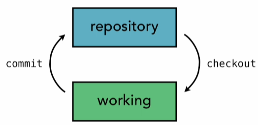
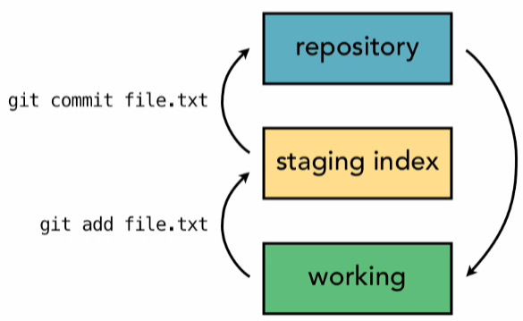

# Distributed Version Control System
> My entire documentation for creating a ```git clone``` not just the command :)

> ```git``` at its core, is a system of interconnected text files that reference each other through filenames.
## The Basics - Understanding Git: 
Common locations where code stays in git:
1. Local Working Directory (Code Playground)
2. Staging Area (Temporary holding spot for files before commiting)
3. Local Repository (Place where we store commited changes locally)
4. Remote Repository (Server for sharing and backing up code)


>Git uses Three-tree Architecture. 

So whats that?

### 1. Two-tree Architecture.

This is what a lot of other VCS use such as Subversion. They have a working tree and repository


### 2. Three-tree Architecture
Git has the working tree and the repository, and additionally in between is another tree which is the staging area.


### Git File States

In Git, files can be in one of three states:

1. **Modified / Untracked**  
   - *Modified*: You've changed the file but haven't saved those changes to your Git history yet.
   - *Untracked*: These files are new and aren't being tracked by Git. They weren’t part of the last commit and haven’t been added to staging.

2. **Staged**  
   - You've marked the modified file to be included in the next commit. It's ready to be saved to the Git history.

3. **Committed**  
   - The file's changes are safely stored in the Git repository.


## Part 1: .git Directory

What does .git directory even contain?

This:

```
$ tree .git

.git
├── config
├── HEAD
├── hooks
│   └── prepare-commit-msg.msample
├── objects
│   ├── info
│   └── pack
└── refs
    ├── heads
    └── tags

```
> Note: if you want tree structure like above for your folder : ``` brew install tree```

### Git Folder and File Structure

When you initialize a Git repository, several files and folders are created. Here's a breakdown of what they are and what they do:

1. **config**  
   - This text file contains the configuration settings for your repository, such as the author information, file modes, and other basic settings.

2. **HEAD**  
   - The `HEAD` file tracks the current branch of the repository. It usually points to `refs/heads/main`, `refs/heads/master`, or another default branch, depending on your setup. After your first commit, the branch file (e.g., `master`) will appear under `refs/heads`.

3. **hooks**  
   - This folder contains scripts that Git can run automatically before or after certain actions (like committing or pushing).

4. **objects**  
   - This folder stores the actual Git objects, which represent your repository's data, such as files, commits, and changes.

5. **refs**  
   - `refs` holds references or pointers to branches and tags.  
   - `refs/heads` contains pointers to branches.  
   - `refs/tags` contains pointers to tags.

Each of these plays a critical role in how Git manages your repository!
